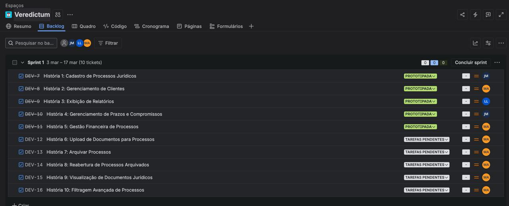
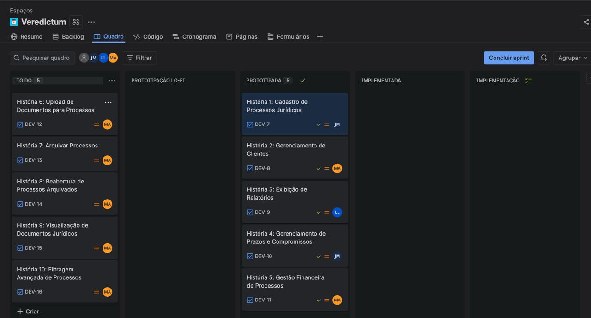

# Veredictum

**Veredictum** é um projeto acadêmico de inovação e tecnologia idealizado por estudantes da **CESAR School** com o propósito de transformar a rotina jurídica por meio de um sistema inteligente de gestão para escritórios de advocacia.
A proposta do projeto é reunir, em uma única plataforma, ferramentas que simplifiquem o acompanhamento de processos, a organização de informações e a execução de tarefas recorrentes do dia a dia jurídico. Mais do que digitalizar fluxos, o Veredictum busca tornar a operação mais fluida, estratégica e eficiente.

## Processos

📷 Entrega 1

 

### 📄 Documento BDD

[BDD Veredictum](./docs/BDD%20VEREDICTUM.md)

### 📄 Jira Backlog

 

### 📄 Jira Board

 

### 🎨 Figma

📦 Entrega 2

 
Em desenvolvimento.

📦 Entrega 3

 
Em desenvolvimento.

📦 Entrega 4

 
Em desenvolvimento.

## Equipe

**Juliana Linden** — [GitHub](https://github.com/jvdlm)

---

**Miguel Arcanjo** — [GitHub](https://github.com/MiguelArcanjoo)

---

**Luis Felipe Furlaneto** — [GitHub](https://github.com/luisfflima)

