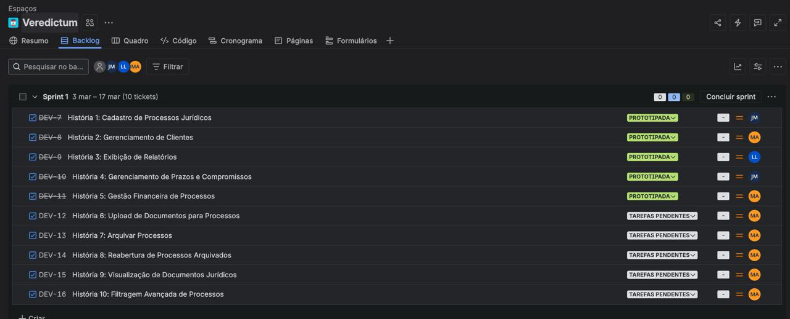
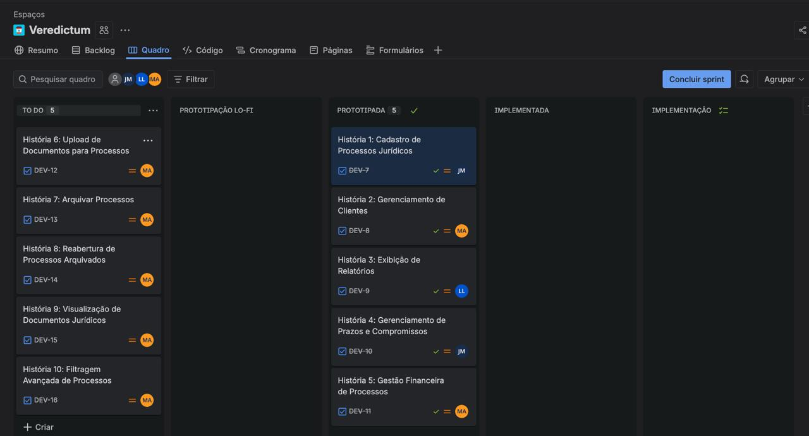
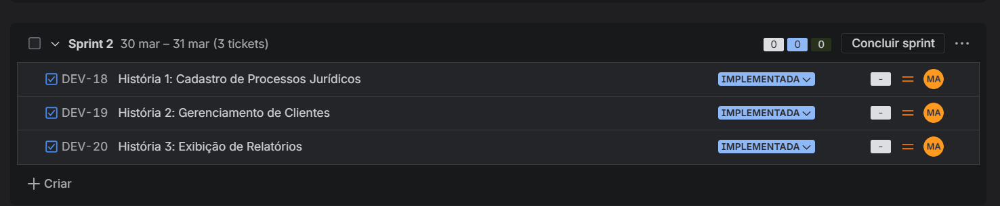
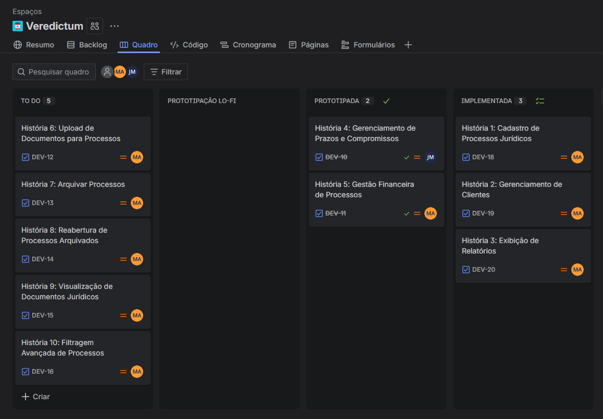

# ⚖ Veredictum

**Veredictum** é um projeto acadêmico de inovação e tecnologia idealizado por estudantes da **CESAR School** com o propósito de transformar a rotina jurídica por meio de um sistema inteligente de gestão para escritórios de advocacia.
A proposta do projeto é reunir, em uma única plataforma, ferramentas que simplifiquem o acompanhamento de processos, a organização de informações e a execução de tarefas recorrentes do dia a dia jurídico. Mais do que digitalizar fluxos, o Veredictum busca tornar a operação mais fluida, estratégica e eficiente.

## Processos

📦 Entrega 1

 

### 📄 Documento BDD

[BDD Veredictum](./docs/BDD%20VEREDICTUM.md)

 

### 📄 Jira Backlog

 

### 📄 Jira Board

 

### 🎨 Protótipo Figma

 

### 🎥 Screencast do Protótipo

🔗 **Assista ao vídeo do protótipo:**  
[Ver Screencast no YouTube]( https://www.youtube.com/watch?v=p-y8VyPhJIk)

📦 Entrega 2

 
 

### 🚀 Deploy da Aplicação

🔗 **Acesse o sistema em produção:**  
[Veredictum Online](COLE_AQUI_O_LINK_DO_DEPLOY)

 

### 🎥 Screencast do Sistema

🔗 **Assista ao vídeo demonstrando o funcionamento do sistema (com deploy):**  
[Ver Screencast no YouTube](COLE_AQUI_O_LINK_DO_VIDEO)

 

### 📋 Jira Backlog - Sprint 02

 

### 📋 Jira Board - Sprint 02

 

### 🐛 Issue Tracker (GitHub)

- [Issue #1 - Cadastro de Processos Jurídicos](LINK_DA_ISSUE_1)
- [Issue #2 - Gerenciamento de Clientes](LINK_DA_ISSUE_2)
- [Issue #3 - Exibição de Relatórios](LINK_DA_ISSUE_3)

📦 Entrega 3

 
Em desenvolvimento.

📦 Entrega 4

 
Em desenvolvimento.

## Equipe

**Juliana Linden** — [GitHub](https://github.com/jvdlm)

---

**Miguel Arcanjo** — [GitHub](https://github.com/MiguelArcanjoo)

---

**Luis Felipe Furlaneto** — [GitHub](https://github.com/luisfflima)

