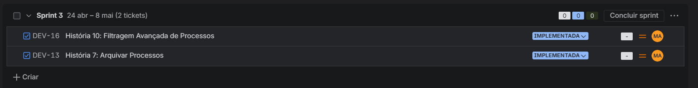
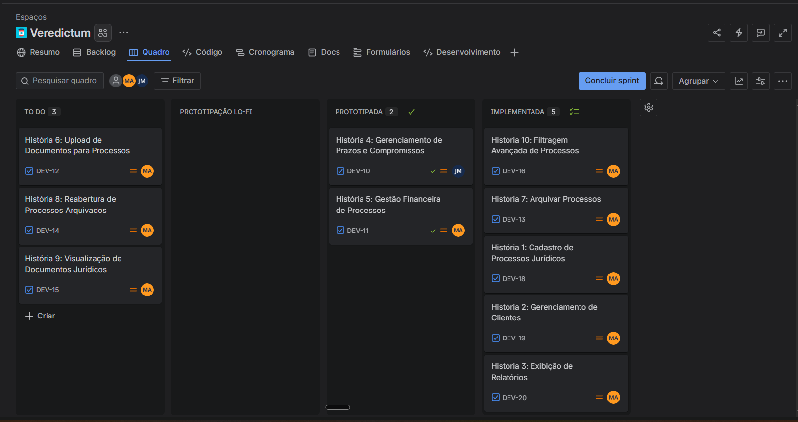

# ⚖ Veredictum

**Veredictum** é um projeto acadêmico de inovação e tecnologia idealizado por estudantes da **CESAR School**, com o propósito de transformar a rotina jurídica por meio de um sistema de gestão para escritórios de advocacia.

A proposta é reunir, em uma única plataforma, ferramentas que simplifiquem o acompanhamento de processos, a organização de informações e a execução de tarefas recorrentes do dia a dia jurídico.

---

## Processos

📦 Entrega 1

 

### 📄 Documento BDD
[BDD Veredictum](./docs/BDD%20VEREDICTUM.md)

 

### 📄 Jira Backlog

 

### 📄 Jira Board

 

### 🎨 Protótipo Figma

 

### 🎥 Screencast do Protótipo
🔗 **Assista ao vídeo do protótipo:**
[Ver Screencast no YouTube](https://www.youtube.com/watch?v=p-y8VyPhJIk)

📦 Entrega 2

 

### 🚀 Deploy da Aplicação
🔗 **Acesse o sistema em produção:**
[https://veredictum.onrender.com/](https://veredictum.onrender.com/)

 

### 🎥 Screencast do Sistema
🔗 **Assista ao vídeo demonstrando o funcionamento do sistema (com deploy):**
[Ver Screencast no YouTube](https://youtu.be/8c9KuVyw2pI?si=4u4UdnBBgPT2_uV4)

 

### 📋 Jira Backlog - Sprint 02

 

### 📋 Jira Board - Sprint 02

 

### 🐛 Issue Tracker (GitHub)
- [Issue #1 - Cadastro de Processos Jurídicos](https://github.com/jvdlm/Veredictum/issues/1)
- [Issue #2 - Gerenciamento de Clientes](https://github.com/jvdlm/Veredictum/issues/2)
- [Issue #3 - Exibição de Relatórios](https://github.com/jvdlm/Veredictum/issues/3)

📦 Entrega 3

 

### 📋 Histórias Implementadas - Sprint 03
- **DEV-13** — História 7: Arquivar Processos
- **DEV-16** — História 10: Filtragem Avançada de Processos

 

### 🚀 Deploy da Aplicação
🔗 **Acesse o sistema em produção:**
[https://veredictum.onrender.com/](https://veredictum.onrender.com/)

 

### 🎥 Screencast das Novas Histórias
🔗 **Assista ao vídeo demonstrando as novas funcionalidades (URL deve aparecer no vídeo):**
[https://youtu.be/IUYvOVF-7iQ]()

 

### ⚙️ CI/CD — GitHub Actions + Render
Pipeline configurado com integração contínua via GitHub Actions e deploy automático via Render.
A cada push na branch `develop`, o workflow é executado automaticamente.

🔗 [Ver pipeline no GitHub Actions](https://github.com/jvdlm/Veredictum/actions)

🎥 **Screencast do processo de build e deploy:**
[https://youtu.be/JXigKV4YVtE?si=nzGnneetGjeurnuc]()

 

### 🧪 Testes de Sistema E2E (Automatizados)
Testes end-to-end implementados com Selenium.

🎥 **Screencast da execução dos testes:**
[https://www.youtube.com/watch?v=UWixGMQY2iA]()

 

### 🐛 Issue Tracker - Sprint 03 (GitHub)
🔗 [Ver issues abertas](https://github.com/jvdlm/Veredictum/issues)

 

### 📋 Jira Backlog - Sprint 02

 

### 📋 Jira Board - Sprint 03

 

### 👥 Programação em Pares
👥 Programação em Pares — Sprint 03
Durante a Sprint 03, a equipe adotou a prática de programação em pares de forma remota, utilizando o Discord com compartilhamento de tela.
Par 1 — Miguel Arcanjo + Luis Felipe Furlaneto
Responsáveis pela implementação das duas histórias da sprint. Miguel conduziu a codificação enquanto Luis acompanhava, revisava e sugeria melhorias em tempo real. Juntos implementaram a funcionalidade de Arquivar Processos (DEV-13), adicionando a view, rota e botão de arquivamento na listagem, e a Filtragem Avançada de Processos (DEV-16), com filtros por status, risco, UF e busca por título. O par também foi responsável pela escrita e execução dos testes automatizados e pela configuração do pipeline de CI/CD no GitHub Actions.
Par 2 — Juliana Linden + Eduardo Henrique
Responsáveis pela documentação, gestão e registro visual do projeto. Juliana conduziu as atualizações do README com a estrutura da Entrega 03, enquanto Eduardo organizou o quadro da Sprint 03 no JIRA, atualizou o status das histórias, registrou as issues no GitHub e ficou responsável pela gravação e edição dos screencasts da entrega, documentando o funcionamento das novas histórias, o pipeline de CI/CD e a execução dos testes automatizados.

📦 Entrega 4

 

Em desenvolvimento.

---

## Equipe

**Juliana Linden** — [GitHub](https://github.com/jvdlm)

---

**Miguel Arcanjo** — [GitHub](https://github.com/MiguelArcanjoo)

---

**Luis Felipe Furlaneto** — [GitHub](https://github.com/luisfflima)

---

**Eduardo Henrique De Sá** — [GitHub](https://github.com/EduardoHenrique15)

---

**João Pedro Silva Barbosa** — [GitHub](https://github.com/JoaoPedroSSBarbosa)

---
